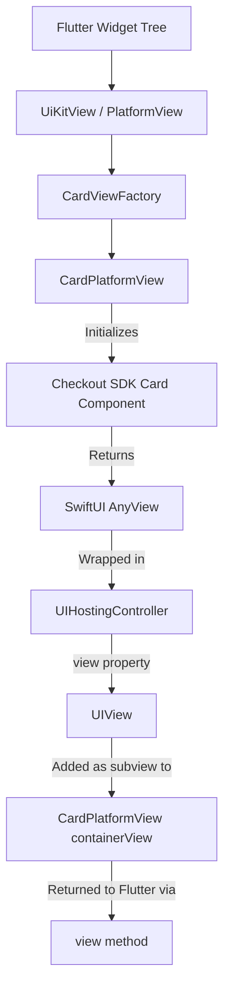

# iOS Native Rendering Architecture

This document explains how the Checkout Flow Flutter SDK renders native iOS components (SwiftUI) within a Flutter application (UIKit-based).

## Overview

The Checkout.com iOS SDK provides modern UI components built with **SwiftUI**. However, Flutter's iOS embedding is based on **UIKit**. To bridge these two worlds, we use a combination of `FlutterPlatformView` and `UIHostingController`.

## Rendering Pipeline

The following diagram illustrates how a SwiftUI-based card component from the Checkout SDK makes its way onto a Flutter screen:



### 1. The Container (`CardPlatformView`)
`CardPlatformView` is the primary bridge class. It implements the `FlutterPlatformView` protocol, which requires a `view()` method that returns a `UIView`.

### 2. SwiftUI to UIKit Bridging (`UIHostingController`)
Since the Checkout SDK's `.render()` method returns a SwiftUI `AnyView`, we cannot directly return it to Flutter. We use `UIHostingController` to bridge them:

```swift
private func embedSwiftUIView(_ view: AnyView) {
    // 1. Wrap SwiftUI view in a Hosting Controller
    let hostingController = UIHostingController(rootView: view)
    hostingController.view.backgroundColor = .clear
    
    // 2. Add the Hosting Controller's view as a subview
    containerView.addSubview(hostingController.view)
    
    // 3. Set up Auto Layout constraints
    hostingController.view.translatesAutoresizingMaskIntoConstraints = false
    NSLayoutConstraint.activate([
        hostingController.view.topAnchor.constraint(equalTo: containerView.topAnchor),
        hostingController.view.leadingAnchor.constraint(equalTo: containerView.leadingAnchor),
        hostingController.view.trailingAnchor.constraint(equalTo: containerView.trailingAnchor),
    ])
}
```

### 3. Layout & Sizing
- **Constraints**: We use `NSLayoutConstraint` to ensure the SwiftUI view matches the horizontal bounds of the container provided by Flutter.
- **Background**: The `UIHostingController`'s view background is set to `.clear` to allow Flutter-defined backgrounds or gradients to show through if necessary.

## Communication Bridge

### Flutter to Native
Flutter sends commands (like `tokenizeCard` or `validateCard`) through a `FlutterMethodChannel`. These are received by the `CheckoutFlutterBridgePlugin`, which delegates them to the active `CardPlatformView`.

### Native to Flutter
The `CardPlatformView` maintains its own `FlutterMethodChannel` (using the same channel name) to emit events back to Dart:
- `cardTokenized`: Sent when the SDK successfully tokenizes the card.
- `validationChanged`: Sent whenever the card input's validity status changes (e.g., user finishes typing a valid number).
- `cardBinChanged`: Sent when the BIN (first 6-8 digits) is identified.
- `paymentSuccess`: Sent for completed payments.
- `paymentError`: Sent for any failures.

## Key Component: `CardPlatformView.swift`

This file is the "brain" of the iOS integration. It:
1.  **Handles Dependencies**: Manages the lifecycle of `CheckoutSDK` and the specific component instance.
2.  **Configures Callbacks**: Maps Checkout SDK closures (like `onTokenized`) to Flutter method calls.
3.  **Manages State**: Tracks if the "Ready" event has been sent to Flutter to avoid redundant UI triggers.

## Summary of Technologies Used
- **SwiftUI**: Modern declarative UI for the payment components.
- **UIKit**: The underlying framework for Flutter's iOS views.
- **UIHostingController**: The bridge that allows SwiftUI views to live inside UIKit parent views.
- **Platform Channels**: Bidirectional communication between Dart and Swift.
